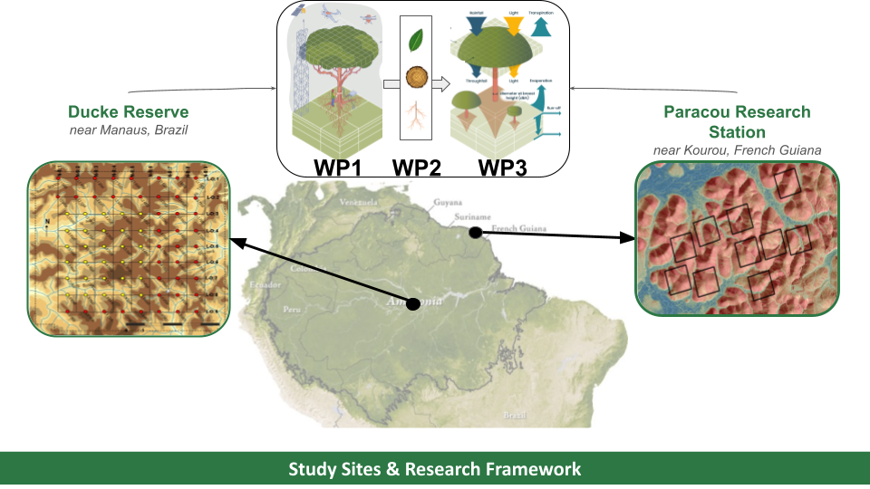

{#fig-framework}

## Context

The Amazon Basin is a key regulator of global carbon, nutrient, and water cycles. While the forest historically functioned as a major carbon sink, this capacity is weakening under deforestation, land-use change, and climate stress. Since the late twentieth century, climate change has intensified the Amazon hydrological cycle — producing wetter rainy seasons, drier dry seasons, and more frequent floods and droughts. A major but underexplored driver of forest responses is **groundwater**: roughly one-third to one-half of Amazon forests overlie shallow water tables that can sustain dry-season evapotranspiration and buffer moderate droughts, while potentially increasing vulnerability to severe or prolonged ones.

## Objectives

HidrAmazônia aims to determine how Amazonian forests respond to increasing droughts and floods under a changing climate, by explicitly integrating groundwater dynamics and plant functional traits into spatially explicit forest models. The project leverages two long-term "super-sites" — the **Ducke Reserve** (near Manaus, Brazil) and the **Paracou research station** (near Kourou, French Guiana) — to:

1. Quantify the role of shallow water tables in buffering or amplifying forest vulnerability to hydrological extremes.
2. Identify above- and belowground functional traits (especially root and hydraulic traits) that control tree tolerance to drought and flooding.
3. Assess how survival and recruitment of young trees under climate extremes shape long-term forest composition and diversity.
4. Project forest structure, composition, and functioning under alternative climate and land-use scenarios, by improving water table representation in the **TROLL** individual-based forest model.

## Central Hypothesis

Forests with shallow water tables buffer the effects of moderate droughts but become increasingly vulnerable under extreme droughts and prolonged or intense flooding, depending on species' functional characteristics. This is tested through three subsidiary hypotheses on drought sensitivity, waterlogging tolerance trade-offs, and the role of young-tree demographic performance in long-term compositional change.

## Work Packages

The project is structured around one coordination work package and three research work packages:

- **WP0 — Coordination, outreach & open science** *(S. Schmitt & F. Costa)*
- **WP1 — Monitoring forest & water dynamics** *(I. Aleixo & A. Mirabel)*
- **WP2 — Characterising ecophysiological processes** *(L. Lugli, C. Salmon & S. Coste)*
- **WP3 — Modelling forest trajectories** *(I. Maréchaux & I. Sampaio)*

## Expected Outcomes

- Quantified limits of groundwater's buffering capacity under extreme climate scenarios.
- Functional traits that best predict tolerance to drought–flood interactions.
- Projections of forest composition, diversity, and ecosystem functioning under climate and land-use change.
- Unprecedented understory tree dynamics data for French Guiana, comparable with existing Manaus data.
- Open-access functional trait databases, including a novel flood-tolerance trait database.
- An enhanced, open-source version of the TROLL model incorporating groundwater and flooding processes.

## Partnership

A French–Brazilian consortium co-led by **Sylvain Schmitt** (CIRAD) and **Flávia Costa** (INPA), bringing together:

- **CIRAD** — Forests & Societies (F&S) and Ecology of the Forest of French Guiana (EcoFoG)
- **INRAE** — Botany and modelling of plant architecture and vegetation (AMAP)
- **CNRS** — Center for Research on Biodiversity and Environment (CRBE)
- **INPA** — National Institute of Amazonian Research, Brazil
- **UFAM** — Federal University of Amazonas, Brazil


